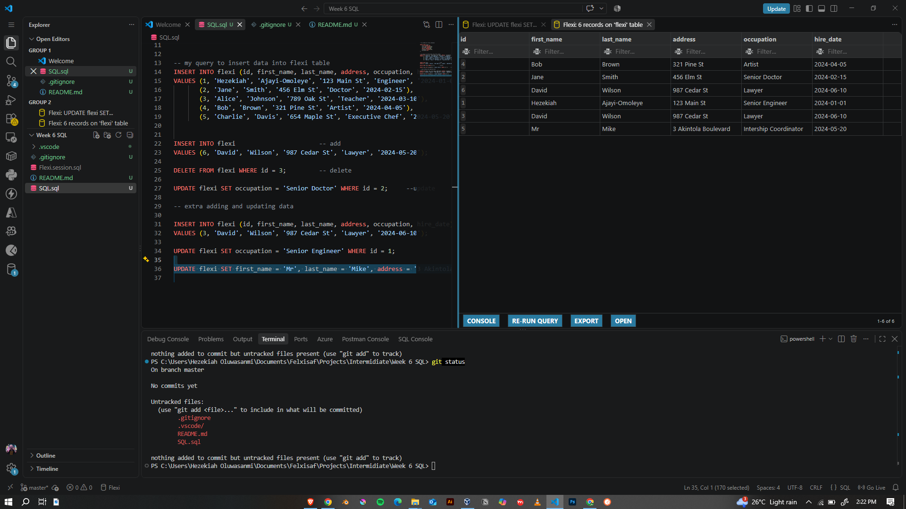

# SQL Learning Journey SQLTutorial.org

## Overview
This repo documents my progress working through [SQLTutorial.org](https://www.sqltutorial.org/), covering core SQL concepts including database/table creation (DDL), data manipulation (DML, INSERT, UPDATE, DELETE), and basic query fundamentals. It also includes the hands-on deliverable I completed: designing and manipulating a `flexi` database.

## What I Learned
- **DDL (Data Definition Language)** — creating tables, defining primary keys and column data types
- **DML (Data Manipulation Language)** — inserting, updating, and deleting records
- **Data types** — `INT`, `VARCHAR`, `DATE`
- **Constraints** — using `PRIMARY KEY` to enforce unique row identity
- **Query structure** — writing clean, readable SQL with proper syntax

## Beyond the Curriculum
While learning about SQL, I went a step further and set up a **local SQL development environment in VS Code**. Using a SQL extension, I was able to:
- Run my own `.sql` scripts directly against a real database engine,
- View and inspect table contents live in the editor,
- Iterate on schema and query changes faster, with a proper dev workflow (file-based, version-controllable SQL) rather than being limited to the browser tool

This gave me a more realistic, production-like workflow for writing and testing SQL compared to just working through the site's exercises.

## Deliverable: `flexi` Database

**Task:** Create a database table with an `id` primary key plus columns for first name, last name, address, occupation, and date. Then write queries to insert, update, and delete records.

### Schema

```sql
-- my schema for flexi database
CREATE TABLE flexi (
    id INT PRIMARY KEY,
    first_name VARCHAR(50),
    last_name VARCHAR(50),
    address VARCHAR(100),
    occupation VARCHAR(50),
    hire_date DATE
);
```

### Insert

```sql
-- my query to insert data into flexi table
INSERT INTO flexi (id, first_name, last_name, address, occupation, hire_date)
VALUES
    (1, 'Hezekiah', 'Ajayi-Omoleye', '123 Main St', 'Engineer', '2024-01-01'),
    (2, 'Jane', 'Smith', '456 Elm St', 'Doctor', '2024-02-15'),
    (3, 'Alice', 'Johnson', '789 Oak St', 'Teacher', '2024-03-10'),
    (4, 'Bob', 'Brown', '321 Pine St', 'Artist', '2024-04-05'),
    (5, 'Charlie', 'Davis', '654 Maple St', 'Chef', '2024-05-20');

-- inserting without naming columns (relies on table column order)
INSERT INTO flexi
VALUES (6, 'David', 'Wilson', '987 Cedar St', 'Lawyer', '2024-06-10');
```

### Delete

```sql
DELETE FROM flexi WHERE id = 3;
```

### Update

```sql
UPDATE flexi SET occupation = 'Senior Engineer' WHERE id = 1;
UPDATE flexi SET occupation = 'Senior Doctor' WHERE id = 2;
```

### Re-insert a deleted record

```sql
INSERT INTO flexi (id, first_name, last_name, address, occupation, hire_date)
VALUES (3, 'David', 'Wilson', '987 Cedar St', 'Lawyer', '2024-06-10');
```

### Revert an update

```sql
UPDATE flexi SET occupation = 'CEO' WHERE id = 1;
```

## Tools Used
- [SQLTutorial.org](https://www.sqltutorial.org/) — core lessons and reference
- VS Code + SQL extension — for writing, running, and viewing queries/tables locally, beyond the browser-only tutorial environment

